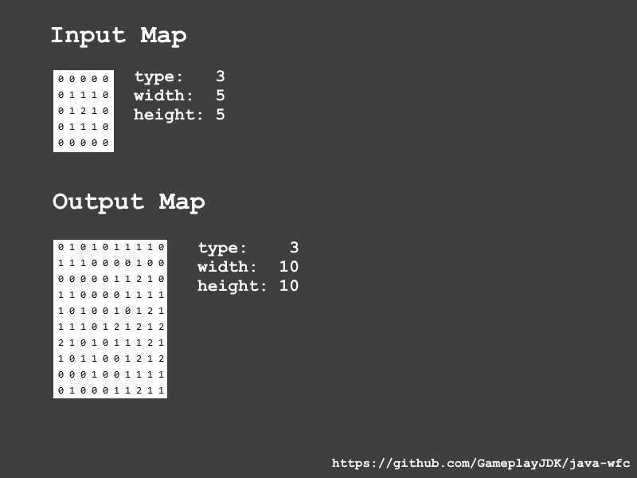

# jwfc (java-wfc)

An abstract java implementation of the wafe function collapse (wfc) algorithm.

It is specifically designed with the simple tiled version of the algorithm in mind. 

Currently the project is work in progress and more of a proof of concept type of thing.

